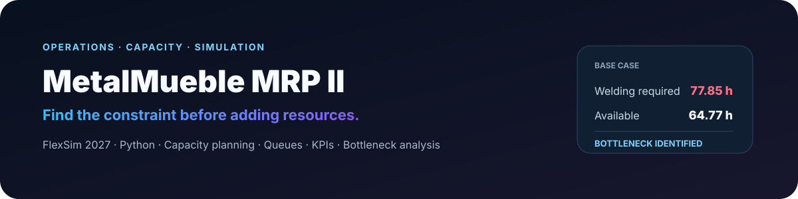
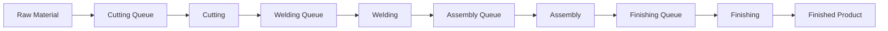

<p align="center">
  
</p>

<p align="center">
  <a href="https://github.com/jtincovalverde/MetalMueble-MRP-II-FlexSim/actions/workflows/validacion.yml"></a>
  <a href="https://www.flexsim.com/"></a>
  <a href="https://www.python.org/"></a>
  
</p>

## Management question

> **Before adding more resources, where is the actual constraint?**

MetalMueble is a manufacturing-capacity and discrete-event simulation case study built around **MRP II and capacity planning**. The project represents the production flow, makes queue formation visible and compares simulation behavior with the numerical capacity analysis.

The goal is not only to simulate machines. The goal is to support a management decision with evidence: **identify where capacity pressure is really occurring before deciding what to change.**

> The general MRP II case was developed as academic group work. This repository brings together the simulation, automation, model organization and technical validation used to present the project. It does not claim sole authorship of every element of the original group case.

## Base-case result

| Indicator | Result |
| --- | ---: |
| Initial production lot | **420 units** |
| Simulation horizon | **40 h** |
| Work center with highest pressure | **Welding** |
| Welding capacity required | **77.85 h** |
| Welding capacity available | **64.77 h** |
| Capacity gap | **+13.08 h** |

**Interpretation:** Welding requires more capacity than is available in the base scenario, so work accumulates before that process and the model identifies it as the main bottleneck.

## Process modeled



| Work center | Processing time |
| --- | ---: |
| Cutting | 5.6976 min/unit |
| Welding | 13.4723 min/unit |
| Assembly | 8.5046 min/unit |
| Finishing | 10.4762 min/unit |

## What the model makes visible

- Physical flow of pieces between work centers
- Queue formation and accumulation
- Waiting time before Welding
- Finished production during the simulation horizon
- System throughput
- Visual bottleneck identification
- Comparison between simulation and capacity analysis

## Why this matters operationally

A visible queue is a symptom. Capacity analysis helps explain **why** it forms.

This project connects both perspectives:

**Observe the flow → measure load and capacity → identify the constraint → test operational improvements.**

That is the management value of the simulation: it provides a controlled environment for understanding the system before changing the real process.

## Main files

You do not need to inspect the entire repository to understand the case. The most important files are:

- **`iniciar_metalmueble.bat`** — launches FlexSim and prepares the model automatically.
- **`modelo_metalmueble.txt`** — contains the model construction and configuration logic.
- **`data/plan_capacidad.csv`** — capacity-planning data used for comparison.
- **`scripts/analisis_capacidad.py`** — reproduces the numerical capacity analysis.
- **`scripts/validar_proyecto.py`** — validates the project's main configuration.
- **`docs/caso_estudio.md`** — summarizes the academic context and principal results.
- **`docs/instrucciones.txt`** — short execution guide.

## Run the simulation

Requires **Windows** and a compatible installation of **FlexSim 2027**.

1. Close FlexSim if it is already open.
2. Run `iniciar_metalmueble.bat`.
3. Allow FlexSim to load and configure the model.
4. Press **Run** once.
5. Advance the simulation to observe queues, processes and finished product.

The launcher locates the local FlexSim installation, prepares a base model and loads `modelo_metalmueble.txt` as the configuration script.

## Capacity analysis

The numerical analysis can be reproduced with:

```bash
python scripts/analisis_capacidad.py
```

The base scenario identifies **Welding** as the overloaded center because required capacity exceeds available capacity.

## Lot-release logic

The first piece is created at `t = 0`, and subsequent pieces are released every `0.06 s`. Creation stops after **420 pieces**, so the full lot is released within approximately the first **25.14 simulated seconds**.

The simulation stops automatically at **40 hours**.

## Queue visualization

Pieces are arranged within each queue area using rows, columns and layers. This avoids showing all work-in-process as a single visual stack and makes accumulation easier to interpret.

The same layout logic is used for finished products.

## Visible KPIs

The model includes indicators for:

- finished units;
- Welding queue content;
- average waiting time before Welding;
- throughput;
- identified bottleneck.

## Automated validation

GitHub Actions runs `scripts/validar_proyecto.py` whenever the repository is updated. The validation checks, among other things:

- the 420-unit production lot;
- the 40-hour horizon;
- processing times;
- principal model object names;
- expected KPI configuration.

This check is **static**. The visual and dynamic behavior of the model must still be verified directly in FlexSim 2027.

## Management takeaway

The project demonstrates a principle that applies beyond manufacturing:

> **Do not add resources only because the operation feels busy. Measure where the constraint actually is.**

---

[← Back to my GitHub profile](https://github.com/jtincovalverde)
